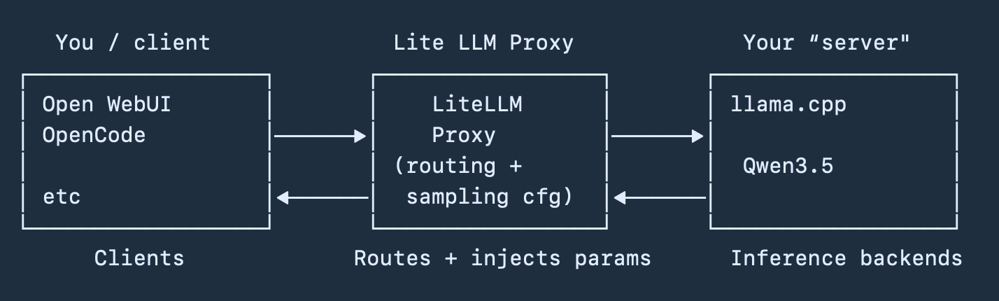

# ai-infra-onprem
AI Infrastructure On-prem


# Manage Qwen 3.5 Model Settings with LiteLLM Proxy


I noticed a lot of people are running the Qwen 3.5 models manually juggling the sampling settings while running Llama.cpp. The easiest way I found is to use LiteLLM Proxy to handle the sampling  settings and let Llama.cpp to serve the model. LiteLLM proxy is really easy to setup.


You / client <——> LiteLLM Proxy <——> Your server running llama.cpp.





# Quickstart
Here are is quick-start guide to help those that never used LiteLLM proxy.


# Run Llama.cpp without sampling settings

First of all make sure you are running Llama.cpp without the sampling settings. Here is what I use (for reference I’m running a 4090 + Ubuntu (popos)):


```

/home/user/llama.cpp/build/bin/llama-server
--model /home/user/models/Qwen3.5-35B-A3B-GGUF/Qwen3.5-35B-A3B-UD-Q4_K_XL.gguf
--mmproj /home/user/models/Qwen3.5-35B-A3B-GGUF/mmproj-F16.gguf
--alias Qwen3.5-35B-A3B-GGUF
--host 0.0.0.0
--port 30000
--flash-attn on
--no-mmap
--jinja
--fit on
--ctx-size 32768

```


Notice the “—port 30000” and “—alias” parameter - this is very important when setting up LiteLLM.


# Install LiteLLM Proxy

Install LiteLLM proxy via pip:

```
pip install 'litellm[proxy]'
```

# Create LiteLLM configuration file

I like to put my config file in .config:

```
nano ~/.config/litellm/config.yaml
```


# Starter configuration

Here I’m going to use Qwen 3.5 35b as an example:

```


# General settings

general_settings:
  master_key: "llm"
  request_timeout: 600

# Models
model_list:

  # Qwen3.5-35B variants
  - model_name: qwen3.5-35b-think-general
    litellm_params:
      model: openai/Qwen3.5-35B-A3B-GGUF
      api_base: http://localhost:30000/v1
      api_key: none
      temperature: 1.0
      top_p: 0.95
      presence_penalty: 1.5
      extra_body:
        top_k: 20
        min_p: 0.0
        repetition_penalty: 1.0
        chat_template_kwargs:
          enable_thinking: true

  - model_name: qwen3.5-35b-think-code
    litellm_params:
      model: openai/Qwen3.5-35B-A3B-GGUF
      api_base: http://localhost:30000/v1
      api_key: none
      temperature: 0.6
      top_p: 0.95
      presence_penalty: 0.0
      extra_body:
        top_k: 20
        min_p: 0.0
        repetition_penalty: 1.0
        chat_template_kwargs:
          enable_thinking: true

  - model_name: qwen3.5-35b-instruct-general
    litellm_params:
      model: openai/Qwen3.5-35B-A3B-GGUF
      api_base: http://localhost:30000/v1
      api_key: none
      temperature: 0.7
      top_p: 0.8
      presence_penalty: 1.5
      extra_body:
        top_k: 20
        min_p: 0.0
        repetition_penalty: 1.0
        chat_template_kwargs:
          enable_thinking: false

  - model_name: qwen3.5-35b-instruct-reasoning
    litellm_params:
      model: openai/Qwen3.5-35B-A3B-GGUF
      api_base: http://localhost:30000/v1
      api_key: none
      temperature: 1.0
      top_p: 0.95
      presence_penalty: 1.5
      extra_body:
        top_k: 20
        min_p: 0.0
        repetition_penalty: 1.0
        chat_template_kwargs:
          enable_thinking: false


```

Each entry will show up as a separate model but they are actually pointing to the same Llama.cpp instance with different sampling settings.

Notice the “model: openai/Qwen3.5-35B-A3B-GGUF” field. The part after “openai/“ needs to match the “—alias” parameter in Llama.cpp. 

Also take note of the “api_base: http://localhost:30000/v1” field - this points to your Llama.cpp server.

The "master_key: “llm”” field is for the api key. I use something short because its running local but you can replace this with whatever you want.


# Run LiteLLM Proxy

Run LiteLLM. We are going to open up port 20000:

```
litellm \
  --config ~/.config/litellm/config.yaml \
  --host 0.0.0.0 \
  --port 20000

```


# Test it!

You should see a list of 4 models:

```

curl http://localhost:20000/v1/models \
  -H "Authorization: Bearer llm" \
  -H "Content-Type: application/json"

```

or test with a chat

```

curl http://localhost:20000/v1/chat/completions \
  -H "Authorization: Bearer llm" \
  -H "Content-Type: application/json" \
  -d '{"model": "qwen3.5-35b-instruct-general", "messages": [{"role": "user", "content": "hello"}]}'

```

# Openwebui or other clients

Using Openwebui as an example: In the connections settings, add a connection point to the base URL (replace local host with your machine’s ip address):

```
http://localhost:20000/v1

```
And then set the api key “llm” or whatever you set in LiteLLM’s config file.

You will now see 4 different models - but its actually one model with different sampling settings!